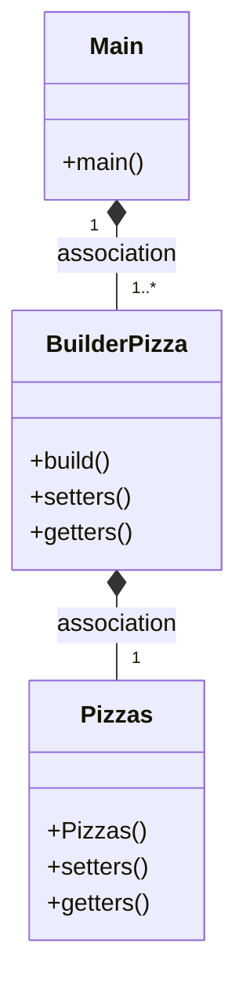

# Uso de Builder()

La función de este patrón permite construir objetos complejos paso a paso. Al contrario que otros patrones creacionales, este no necesita que los productos tengan una interfaz común. Esto hace posible crear distintos productos utilizando el mismo proceso de construcción.

## ¿Se puede fusionar con el patrón factory?

Sí, es posible combinar el patrón Builder con el patrón Factory en programación.

El patrón Builder se utiliza para crear objetos complejos paso a paso, mientras que el patrón Factory se utiliza para crear objetos de una manera más genérica. Al combinar estos dos patrones, podemos crear objetos complejos de una manera más genérica y escalable.

Por ejemplo, podemos usar el patrón Factory para crear un objeto Builder y luego usar el objeto Builder para construir el objeto complejo. De esta manera, podemos utilizar el patrón Factory para crear diferentes tipos de objetos Builder y luego utilizar el objeto Builder específico para construir el objeto complejo.

Esta combinación de patrones puede ser especialmente útil en situaciones en las que necesitamos crear objetos complejos con diferentes configuraciones y opciones, y queremos hacerlo de una manera más genérica y escalable.

---

      

