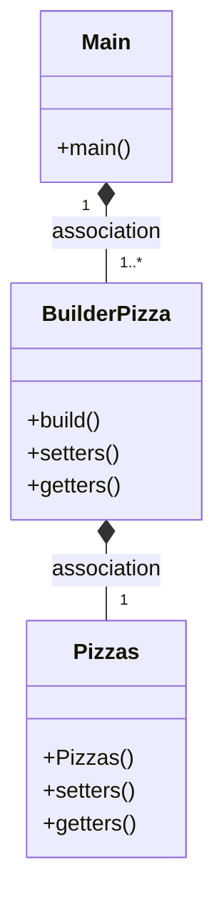
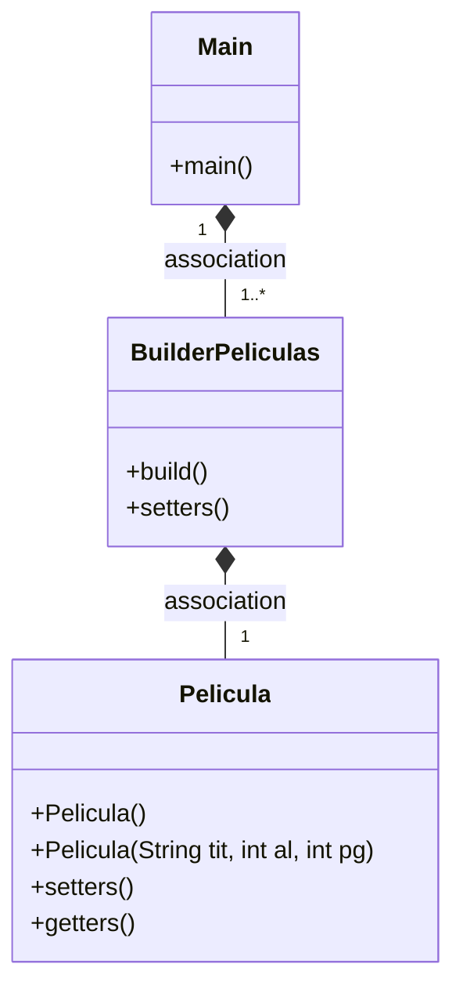

# Uso de Builder()

La función de este patrón permite construir objetos complejos paso a paso. Al contrario que otros patrones creacionales, este no necesita que los productos tengan una interfaz común. Esto hace posible crear distintos productos utilizando el mismo proceso de construcción.

## ¿Se puede fusionar con el patrón factory?

Sí, es posible combinar el patrón Builder con el patrón Factory en programación.

El patrón Builder se utiliza para crear objetos complejos paso a paso, mientras que el patrón Factory se utiliza para crear objetos de una manera más genérica. Al combinar estos dos patrones, podemos crear objetos complejos de una manera más genérica y escalable.

Por ejemplo, podemos usar el patrón Factory para crear un objeto Builder y luego usar el objeto Builder para construir el objeto complejo. De esta manera, podemos utilizar el patrón Factory para crear diferentes tipos de objetos Builder y luego utilizar el objeto Builder específico para construir el objeto complejo.

Esta combinación de patrones puede ser especialmente útil en situaciones en las que necesitamos crear objetos complejos con diferentes configuraciones y opciones, y queremos hacerlo de una manera más genérica y escalable.

---



---

# Evaluación 2 (2da parte)

## 1. ¿Cuál es la función del patrón Builder? Pon ejemplo (que no sea de Pizzas)

La función del patrón Builder, como bien se comentó en la tarea, tiene el facilitar la creación de objetos complejos de una formas más sencilla, usando un procedimiento de "paso a paso".
Esto permite que la construcción de forma que, aunque parezcan objetos diferentes, tiene los principios del patrón; separando la construcción de un objeto de su presentación (de forma tal que con el mismo proceso se puedan crear diferentes representaciones).

**Ejemplo:**

*Creamos una clase Película en el cual tiene sus parámetros, como es el título, año de lanzamiento, y premios ganados:*

```
public class Pelicula{
    private String titulo;
    private int añoLanzamiento;
    private int premiosGanados;
    
    public Pelicula(){
        this.titulo="Desconocido";
        this.añoLanzamiento=0;
        this.premiosGanados=0;
    }
    
    public Pelicula(String tit,int al,int pg){
        this.titulo=tit;
        this.añoLanzamiento=al;
        this.premiosGanados=pg;
    }
    
    setters()...
    getters()...
    toString()...
}
```
*Al crear este objeto, en una clase Builder, el constructor Builder devuelve a un objeto tipo Pelicula (de esta manera podemos configurarla con métodos parecidos a los setters y getters de la clase Pelicula)*

```
public class BuilderPeliculas{
    private Pelicula _pelicula;
    
    public BuilderPeliculas(){
        _pelicula= new Pelicula;
    }
    
    public BuilderPeliculas setTitulo(String titulo){
        _pelicula.setTitulo(titulo);
        return this;
    }

    public BuilderPeliculas setAñoLanzamiento(int al) {
        _pelicula.setAñoLanzamiento(al);
        return this;
    }
    
    public BuilderPeliculas setPremiosGanados(int pg) {
        _pelicula.setPremiosGanados(pg);
        return this;
    }

    public Pelicula build(){
        return this._pelicula;
    }
}
```

*Este último método es **crucial** ya que nos retorna el objeto configurado.*

*Finalmente, de esta manera podemos crear una película según lo deseado en la main, teniendo las caracteristicas por default si no fueron modificadas:*

```
Pelicula miPeli = new BuilderPeliculas()
.setTitulo("Lords of Dogtown")
.setAñoLanzamiento(2010)
.build();
System.out.println(miPizza.toString());
}
```

---
# 2.Diagrama



# 3. ¿Podríamos combinarlo con el patrón Factory? Explicalo con algo de código cómo lo harías

Ambos patrones de código secuencial pueden ser trabajados en conjunto.

Un ejemplo podría ser el crear una productora de películas, para seguir con el ejemplo anterior:

*Creamos una interfaz para las peliculas creadas con el patrón Builder*
```
public interface IPelicula{
    public void setTitulo(String t);
    public void setAñoLanzamiento(int al);
    public void setPremiosGanados(int pg);
}
```
*Implementamos en varias clases creadas esta interfaz (una de ejemplo)*
```
public class PeliculasDeTerror implements IPelicula{
    private String titulo="";
    private int añoLanzada=0;
    private int premios=0;
    
    @Override
    setters()...
}
```

*Aquí entra en acción la fábrica de películas:*
```
public interface IPeliculasFactory{
   public Pelicula crearPelicula();
}
```

*De esta manera con nuestro patron BuilderPeliculas podemos configurar una interfaz totalmente nueva para crear Peliculas de Terror:*
```
public class PeliculasDeTerrorFactory implements IPeliculasFactory{
    @Override
    public Pelicula crearPelicula(){
        BuilderPeliculas miPeliTerror= new Pelicula();
        miPeliTerror.setters()...
        
        return miPeliTerror.getPelicula();
    }
}
```

*Finalmente, podemos tener una fabrica en la cual podamos crear películas segun la categoría deseada!*


